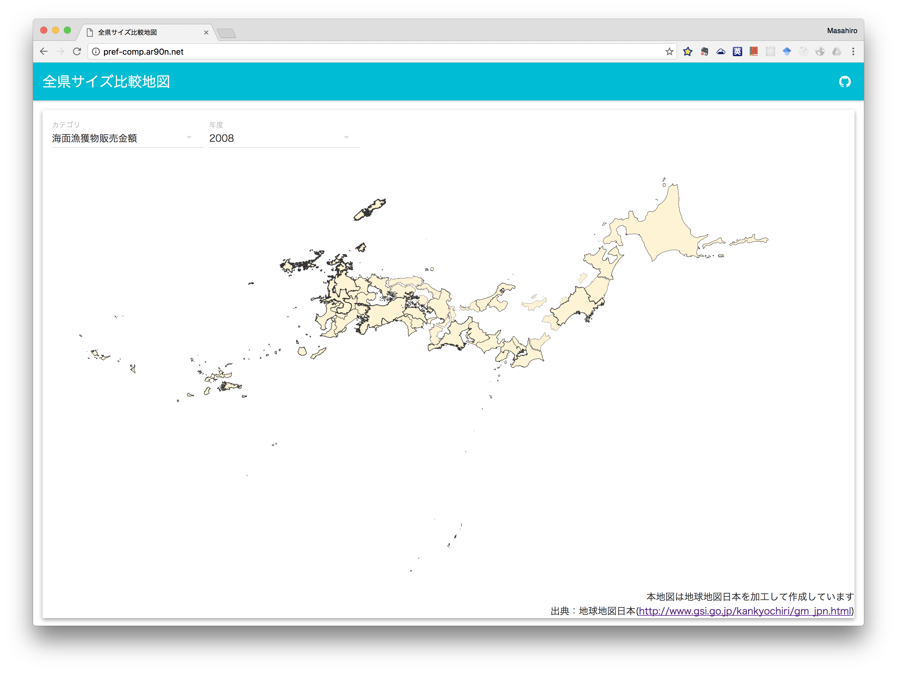
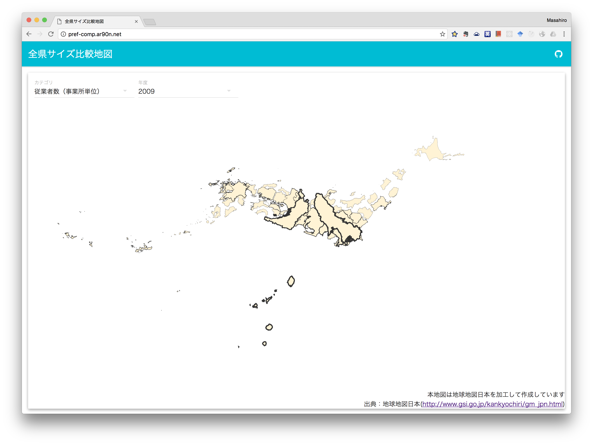

せっかく[resaspy](https://github.com/ar90n/resaspy)を作ったので，これを使って簡単な[サイト](http://pref-comp.ar90n.net)を作ってみました．  
RESASから取得した統計データに応じて，各県の面積を変更して表示します．

海面漁獲物販売金額でやってみるとこんな感じ

北海道がやはり強いですね！長野と岐阜は消えてしまってる．．．  
従業者数でやってみると．．．

東京と大阪が圧倒的！大きさという形で表現すると他との比較がわかりやすいですね.
