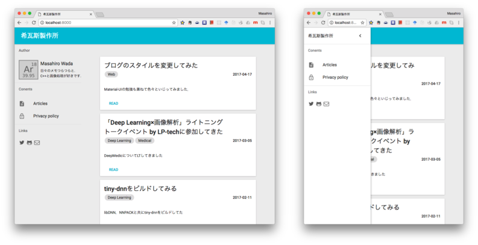

Material-UIの勉強も兼ねて色々といじってみました．

### 基本方針
* 可能な限りマテリアルデザインのデザインガイドに従う
* gatsbyjs-starter-lumenを叩き台に各コンポーネントを置き換える

### 実装結果


### gatsbyjsでmaterial-uiを使う時のメモ
Material-UIはthis.contextを経由して各コンポーネントにテーマの設定値を渡すため，ユーザーのルートコンポーネントをMuiProviderでラップする必要がある．
通常のWebアプリならReactにマウントする際にラップすればよいが，gatsbyjsではこの処理が既定であるため所定の操作でフックする必要がある．
[web-entry.js](https://github.com/gatsbyjs/gatsby/blob/master/lib/utils/web-entry.js)をみると，以下の６つのエントリポイントが確認できる．

* onRouteChange
* onRouteUpdate
* modifyRoutes
* shouldUpdateScroll
* replaceDOMRenderer
* wrapRootComponent

これらをgatsby-browser.jsに定義することで各処理をフックすることができる．
今回はwrapRootComponentを用いて，ルートコンポーネントを以下のようにラップした．
```
exports.wrapRootComponent = (root) => () => {
  return (
    <MuiThemeProvider>
      {root()}
    </MuiThemeProvider>
  )
};
```
### withWidthを使ってレスポンシブルに
せっかくなので，レスポンシブルにしたい．Material-UIには，withWidthという関数がHigher Order Componentsとして提供されているのでこれを使ってみることにした．
```
class SiteRoot extends React.Component {
    ...
}

const options = {
    largeWidth: 992,
    mediumWidth: 992
};
export default withWidth( options )( SiteRoot );
```

こうすることで，SiteRoot のpropsにwidthというキーでウインドウサイズに応じた値が渡される．
(本来はSMALL,MEDIUM,LARGEだが，largeWidthとmediumWidthに同じ値を設定しているので今回はSMALLかLARGEのみ）
この値を使ってrenderの処理を変更することでレスポンシブルなページが実現できる．
