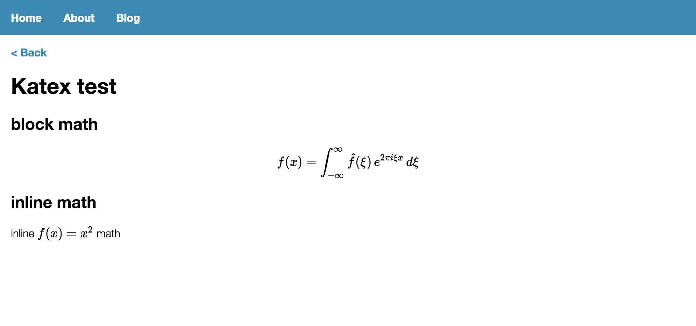

数式表現にも対応しておく．

## やったこと

1. remark-mathとreact-katexによるKaTeXのサポート

以下のような感じで表示されます．


## KaTeXのサポート
基本的な処理の流れは以下のようになります

1. remark-mathにてmarkdown中の$と$$をそれぞれinlineMathノードとmathノードにパース．
1. remark-reactにてReactコンポーネントに変換する前に，inlineMathノードとmathノードをそれぞれ，imathタグとmathタグに変換する．
1. imathタグとmathタグのReactコンポーネントへの変換処理をフックして，それぞれreact-katexのInlineMathとBlocKMathに変換する．

上述の処理を実現するために，以下の処理を追加しました．

* inlineMathノードとmathノードの変換処理のため，remark-reactのtoHASKオプションにハンドラを追加．ハンドラはノードタイプをキーとして，値に変換後のHASTノードを返す関数を持つmapで表現されます．この関数内でnode.data.hNameに所望の値を設定することで変換処理を行なっています．
* サニタイズの際に，mathタグとimathタグを削除しないようtagNamesにmathとimathを追加します．
* mathタグ, imathタグに対する変換処理をremarkReactComponentsに追加します．

以上の対応を追加したtsxは以下のような感じになりました．
```tsx
import React from 'react'
import { withRouteData, Link } from 'react-static'
import remark from 'remark'
import remarkReact from 'remark-react'
import remarkMath from 'remark-math'
import Highlight from 'react-highlight'
import { InlineMath, BlockMath } from 'react-katex';

import 'katex/dist/katex.min.css';
import 'highlight.js/styles/rainbow.css';
import githubSchema from 'hast-util-sanitize/lib/github.json';

const schema = Object.assign({}, githubSchema, {
  attributes: Object.assign({}, githubSchema.attributes, {
    code: [
      ...(githubSchema.attributes.code || []),
      'className'
    ]
  }),
  tagNames: [
    ...(githubSchema.tagNames),
    'math',
    'imath'
  ]
});

const code = ( { className, children } ) => (
    <Highlight className={className} >
        {children}
    </Highlight>
);

const math = ( { children } ) => (
    <BlockMath>
        {children[0]}
    </BlockMath>
);

const imath = ({ children }) => (
    <InlineMath>
        {children[0]}
    </InlineMath>
);

const handlers = {
    math: (h, node, parent) => {
        node.data.hName = 'math';
        return h(node, 'math', {});
    },
    inlineMath: (h, node, parent) => {
        node.data.hName = 'imath';
        return h(node, 'imath', {});
    },
};

const processor = remark()
    .use(remarkMath)
    .use(remarkReact, {
      toHast: { handlers },
      sanitize: schema,
      remarkReactComponents: { code, math, imath },
    });

export default withRouteData(({ content }: any) => (
  <div>
    <Link to="/blog/">{'<'} Back</Link>
    <br />
    <div>
      {processor.processSync(content).contents}
    </div>
  </div>
))
```

## 所感
MDASTやHASTなどいまいち良く理解できていないが，目的は達成できたので良しとしたい．  
今後remarkを拡張することがあれば，今回使用したプラグインを参考にすれば良さそう．
