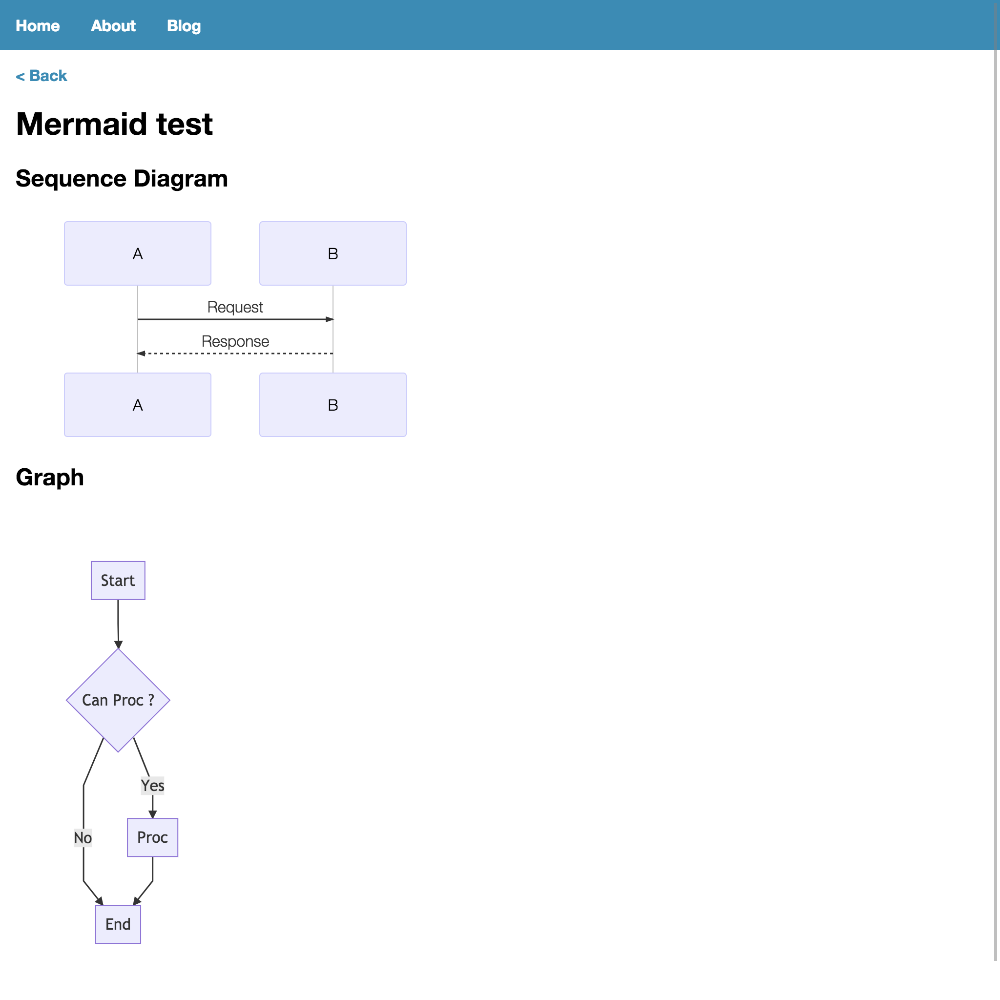

気軽に図をかけるようにもしておく．

## やったこと

1. Mermaidを使って図をかけるようにした．

以下のような感じで表示されます．


## Mermaidのサポート
remark-reactでcodeタグをReactコンポーネントに変換する際に，classNameが"language-mermaid"の場合は別途用意したコンポーネントを使用します．
ただそれだけです．

以上の対応を追加したtsxは以下のような感じになりました．
```tsx
import React from 'react'
import { withRouteData, Link } from 'react-static'
import remark from 'remark'
import remarkReact from 'remark-react'
import remarkMath from 'remark-math'
import Highlight from 'react-highlight'
import { InlineMath, BlockMath } from 'react-katex';
import { Mermaid } from './Mermaid';

import 'katex/dist/katex.min.css';
import 'highlight.js/styles/rainbow.css';
import githubSchema from 'hast-util-sanitize/lib/github.json';

const schema = Object.assign({}, githubSchema, {
  attributes: Object.assign({}, githubSchema.attributes, {
    code: [
      ...(githubSchema.attributes.code || []),
      'className'
    ]
  }),
  tagNames: [
    ...(githubSchema.tagNames),
    'math',
    'imath'
  ]
});


const code = ( { className, children } ) => {
    const Component = ( className == 'language-mermaid') ? Mermaid : Highlight;
    return (
        <Component className={className} >
            {children}
        </Component>
    );
}

const math = ( { children } ) => (
    <BlockMath>
        {children[0]}
    </BlockMath>
);

const imath = ({ children }) => (
    <InlineMath>
        {children[0]}
    </InlineMath>
);

const handlers = {
    math: (h, node, parent) => {
        node.data.hName = 'math';
        return h(node, 'math', {});
    },
    inlineMath: (h, node, parent) => {
        node.data.hName = 'imath';
        return h(node, 'imath', {});
    },
};

const processor = remark()
    .use(remarkMath)
    .use(remarkReact, {
      sanitize: schema,
      remarkReactComponents: { code, math, imath },
      toHast: { handlers }
    });

export default withRouteData(({ content }: any) => (
  <div>
    <Link to="/blog/">{'<'} Back</Link>
    <br />
    <div>
      {processor.processSync(content).contents}
    </div>
  </div>
))
```

実際にMermaidをパースして表示するコンポーネントは以下のような感じです．
[こちら](https://www.developmentsindigital.com/posts/2017-10-26-mermaid-in-react/)のサイトを参考にしました．
```tsx
import * as React from 'react';
import mermaid from 'mermaid';

interface IProps extends React.Props<{}> {
    className?: any;
}

interface IState {
    __html: any;
}

class Mermaid extends React.Component<IProps, IState> {
  constructor(props: IProps) {
    super(props)
    this.state = {
      __html: null
    }

    mermaid.mermaidAPI.initialize({
      startOnLoad: false
    })
  }

  componentDidMount() {
    mermaid.mermaidAPI.render('id', this.props.children[0], __html => {
       this.setState({ __html })
    })
  }

  render() {
    return <div className={this.props.className} dangerouslySetInnerHTML={this.state} />
  }
}

export {
    IState,
    IProps,
    Mermaid,
};
```

## 所感
あっさりと図がかけて非常に便利に思います．
ブログ記事を書くのに必要な機能はだいぶ揃ってきたので，次回からは全体のUIに取り掛かろうと思います．

## 参考

1. [https://www.developmentsindigital.com/posts/2017-10-26-mermaid-in-react/](https://www.developmentsindigital.com/posts/2017-10-26-mermaid-in-react/)
